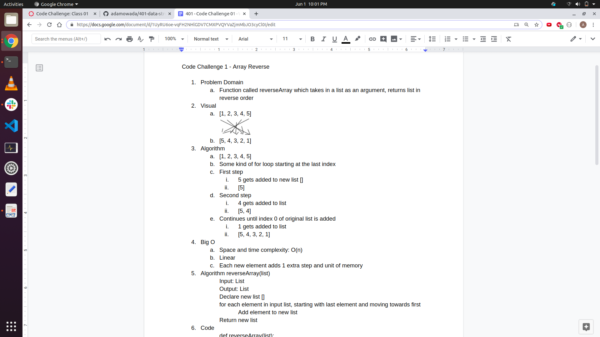
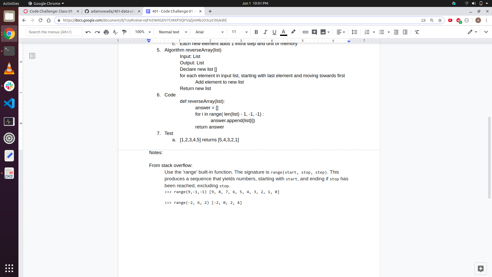
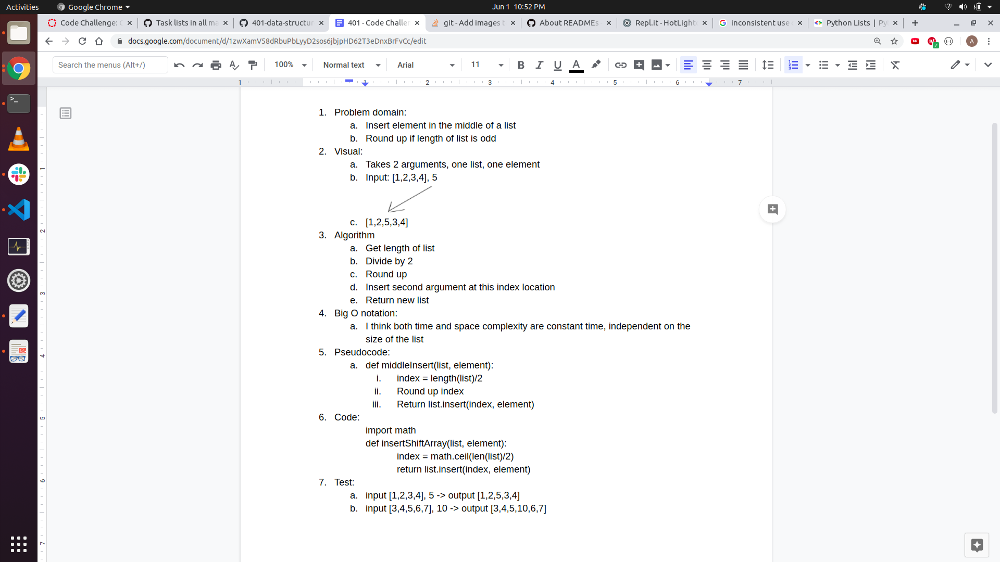
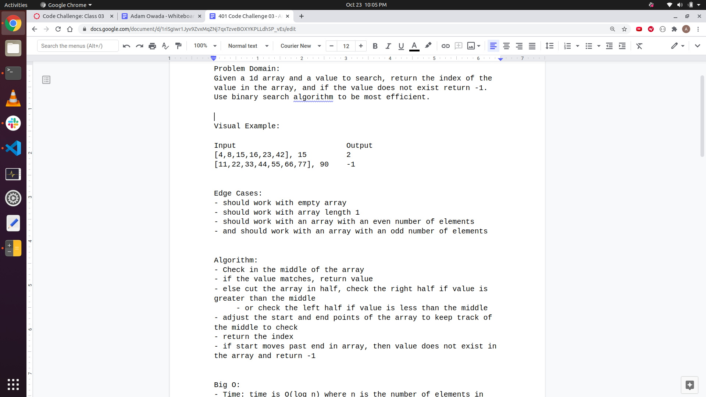
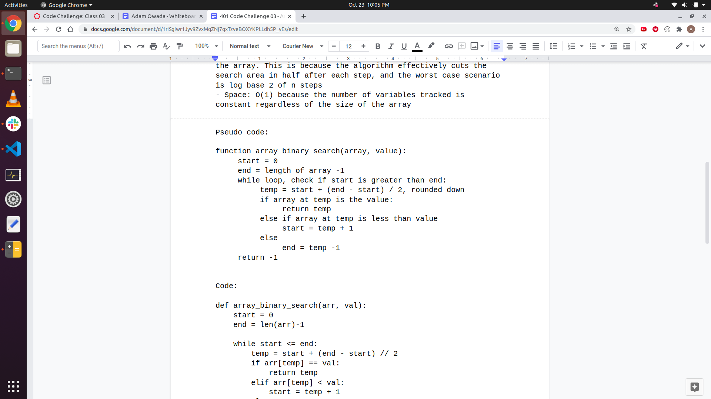
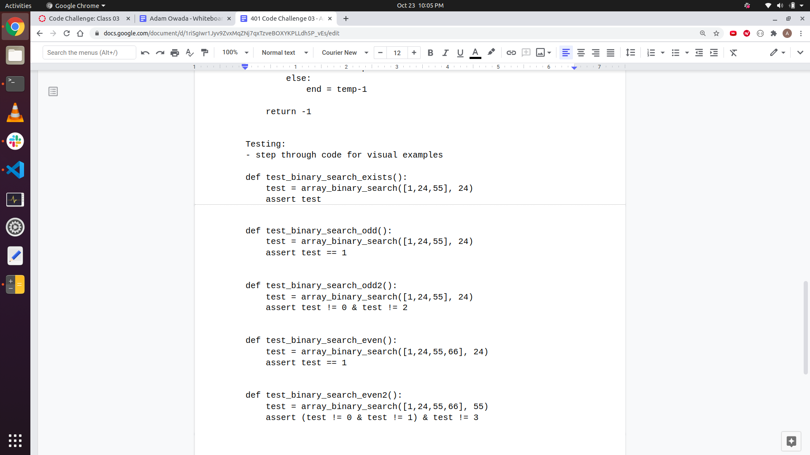
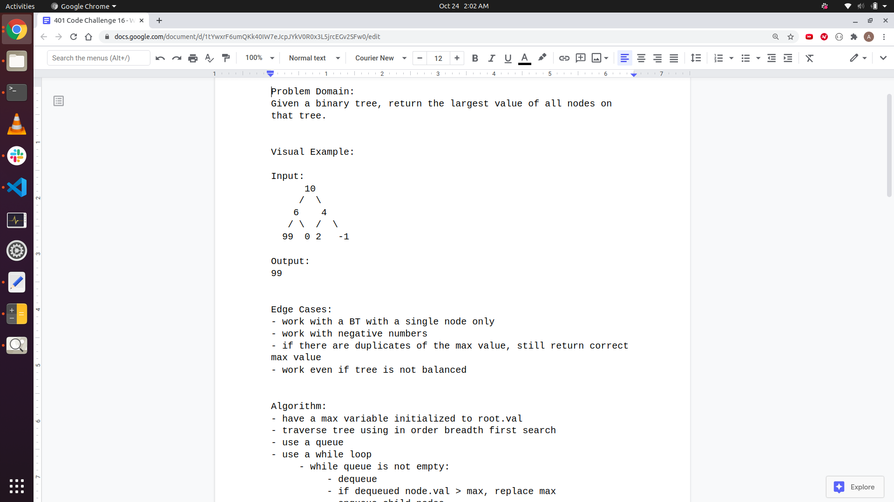
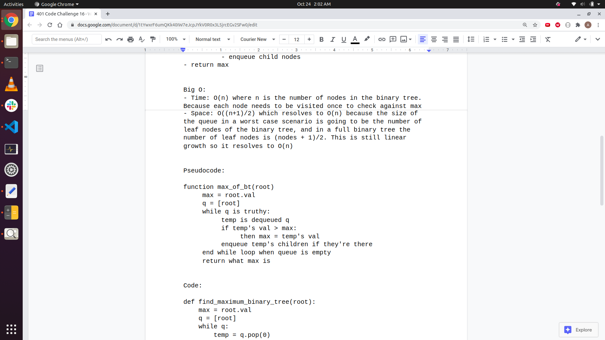
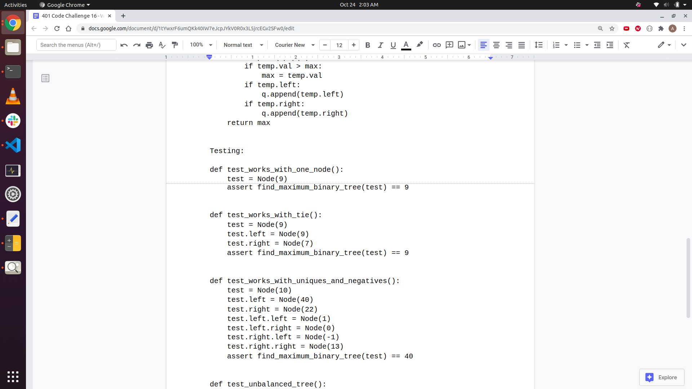
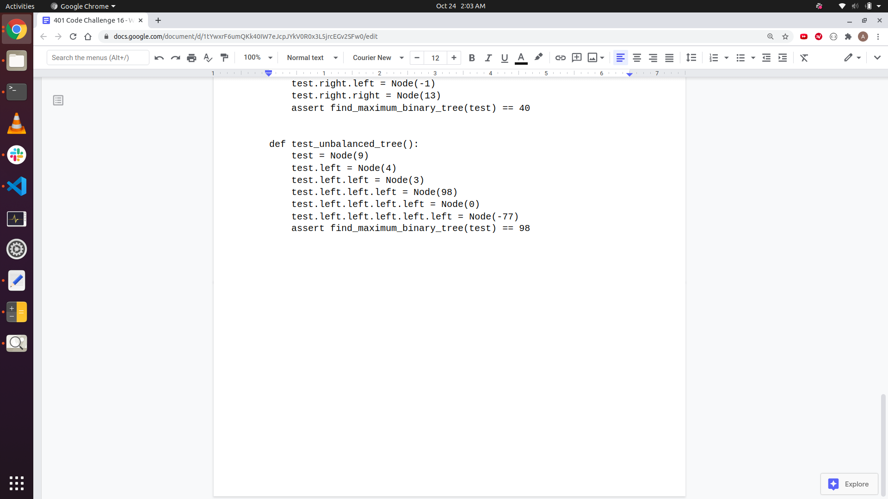

# 401-data-structures-and-algorithms
Repo for 401 Code Challenges

Adam Owada

# Table of Contents


# Code Challenge 1
### Reverse an Array
Write a function called reverseArray that takes in a list and returns the list in reverse order.

### Challenge
```
Input	                                    Output
[1, 2, 3, 4, 5, 6]	                      [6, 5, 4, 3, 2, 1]
[89, 2354, 3546, 23, 10, -923, 823, -12]	[-12, 823, -923, 10, 23, 3546, 2354, 89]
```

### Approach & Efficiency
Used a for loop with range to append elements from the list argument into an empty list in reverse order and return new list.

### Solution




# Code Challenge 2
### Insert Shift Array
Write a function called insertShiftArray that takes in a list and a value to be added, and returns the list with the value in the middle.

### Challenge
```
Input	                Output
[2,4,6,8], 5	        [2,4,5,6,8]
[4,8,15,23,42], 16	  [4,8,15,16,23,42]
```

### Approach & Efficiency
Used math.ceil to find proper index, and list.insert to insert into the list.

### Solution



# Code Challenge 3
### Binary Search a 1d Array
Write a function called BinarySearch which takes in 2 parameters: a sorted array and the search key. Without utilizing any of the built-in methods available to your language, return the index of the array’s element that is equal to the search key, or -1 if the element does not exist.

### Challenge
```
Input	                        Output
[4,8,15,16,23,42], 15	        2
[11,22,33,44,55,66,77], 90	    -1
```

### Approach & Efficiency
Successfully used binary search, with Big O time complexity of log(n) where n is the number of elements in the input array. 

### Solution





# Code Challenge 5
### Linked List Implementation
Create a Node class that has properties for the value stored in the Node, and a pointer to the next Node.
Within your LinkedList class, include a head property. Upon instantiation, an empty Linked List should be created.

### Challenge
```
Define a method called insert which takes any value as an argument and adds a new node with that value to the head of the list with an O(1) Time performance.
Define a method called includes which takes any value as an argument and returns a boolean result depending on whether that value exists as a Node’s value somewhere within the list.
Define a method called __str__ which takes in no arguments and returns a string representing all the values in the Linked List, formatted as:
"{ a } -> { b } -> { c } -> NULL"
```

### Approach & Efficiency
Used classes and OOP to solve this challenge. LinkedList instance method insert() changes the value of the head and makes current head the new nodes .next. Method includes() uses a while loop to check each node. If none of the node.value equals the passed in value, returns false. Returns true if one of the nodes .value equals the passed in value. Method __str__ is a python string method visually representing all of the nodes in the linked list, in order, with an arrow pointing to the next node and its value. 

### Solution
No whiteboard requirement for this challenge. 


# Code Challenge 6
### Linked List Insertions
Write the following methods for the Linked List class:

.append(value) which adds a new node with the given value to the end of the list
.insertBefore(value, newVal) which add a new node with the given newValue immediately before the first value node
.insertAfter(value, newVal) which add a new node with the given newValue immediately after the first value node

### Challenge
```
.append(value)
Input	                    Args	    Output
head -> [1] -> [3] -> [2] -> X	5	head -> [1] -> [3] -> [2] -> [5] -> X
head -> X	1	head -> [1] -> X

.insertBefore(value, newVal)
Input	                    Args	    Output
head -> [1] -> [3] -> [2] -> X	3, 5	head -> [1] -> [5] -> [3] -> [2] -> X
head -> [1] -> [3] -> [2] -> X	1, 5	head -> [5] -> [1] -> [3] -> [2] -> X
head -> [1] -> [2] -> [2] -> X	2, 5	head -> [1] -> [5] -> [2] -> [2] -> X
head -> [1] -> [3] -> [2] -> X	4, 5	Exception

.insertAfter(value, newVal)
Input	                    Args	    Output
head -> [1] -> [3] -> [2] -> X	3, 5	head -> [1] -> [3] -> [5] -> [2] -> X
head -> [1] -> [3] -> [2] -> X	2, 5	head -> [1] -> [3] -> [2] -> [5] -> X
head -> [1] -> [2] -> [2] -> X	2, 5	head -> [1] -> [2] -> [5] -> [2] -> X
head -> [1] -> [3] -> [2] -> X	4, 5	Exception
```

### Approach and Efficiency
Did my insertion methods iteratively with a while loop, checking for the end of the linked list for the append, checking for the .next for the insert_before, and for the value for the insert_after.

### Solution


# Code Challenge 7
### Linked List kth From End
Write a method for the Linked List class which takes a number, k, as a parameter. Return the node’s value that is k from the end of the linked list. You have access to the Node class and all the properties on the Linked List class as well as the methods created in previous challenges.

### Challenge
```
ll.kthFromEnd(k)
Input ll	Arg k	Output
head -> [1] -> [3] -> [8] -> [2] -> X	0	2
head -> [1] -> [3] -> [8] -> [2] -> X	2	3
head -> [1] -> [3] -> [8] -> [2] -> X	6	Exception
```

### Approach and Efficiency
I used two pointers, one lagging and one current. I used the k argument as a counter and decremented as part of my while loop. Once k hit 0 I started moving my lagging pointer to its .next. Once current.next is None I knew my current node was the last node in the linked list and I exited the while loop. Then I conditionally returned the lagging pointer's value if k was 0. If k ended greater that 0 it raises an exception

### Solution


# Code Challenge 16
### Find Maximum Value in Binary Tree
Write an instance method called find-maximum-value. Without utilizing any of the built-in methods available to your language, return the maximum value stored in the tree. You can assume that the values stored in the Binary Tree will be numeric.

### Challenge
```
Input:
       9
      / \
     11  7
    / \  / \
   8   1 0  14
    \
     13

Output:
14
```

### Approach and Efficiency
I used an iterative, breadth first approach, utilizing a queue. In my while loop I dequeued and compared its value. Then I enqueued it's children. I did this until the queue was empty, meaning each node had been traversed once

### Solution




