# 401-data-structures-and-algorithms
Repo for 401 Code Challenges

Adam Owada

# Table of Contents


# Code Challenge 1
### Reverse an Array
Write a function called reverseArray that takes in a list and returns the list in reverse order.

### Challenge
```
Input	                                    Output
[1, 2, 3, 4, 5, 6]	                      [6, 5, 4, 3, 2, 1]
[89, 2354, 3546, 23, 10, -923, 823, -12]	[-12, 823, -923, 10, 23, 3546, 2354, 89]
```

### Approach & Efficiency
Used a for loop with range to append elements from the list argument into an empty list in reverse order and return new list.

### Solution


# Code Challenge 2
### Insert Shift Array
Write a function called insertShiftArray that takes in a list and a value to be added, and returns the list with the value in the middle.

### Challenge
```
Input	                Output
[2,4,6,8], 5	        [2,4,5,6,8]
[4,8,15,23,42], 16	  [4,8,15,16,23,42]
```

### Approach & Efficiency
Used math.ceil to find proper index, and list.insert to insert into the list.

### Solution


# Code Challenge 3
### Binary Search a 1d Array
Write a function called BinarySearch which takes in 2 parameters: a sorted array and the search key. Without utilizing any of the built-in methods available to your language, return the index of the array’s element that is equal to the search key, or -1 if the element does not exist.

### Challenge
```
Input	                        Output
[4,8,15,16,23,42], 15	        2
[11,22,33,44,55,66,77], 90	    -1
```

### Approach & Efficiency
Successfully used binary search, with Big O time complexity of log(n) where n is the number of elements in the input array. 

### Solution


# Code Challenge 5
### Linked List Implementation
Create a Node class that has properties for the value stored in the Node, and a pointer to the next Node.
Within your LinkedList class, include a head property. Upon instantiation, an empty Linked List should be created.

### Challenge
```
Define a method called insert which takes any value as an argument and adds a new node with that value to the head of the list with an O(1) Time performance.
Define a method called includes which takes any value as an argument and returns a boolean result depending on whether that value exists as a Node’s value somewhere within the list.
Define a method called __str__ which takes in no arguments and returns a string representing all the values in the Linked List, formatted as:
"{ a } -> { b } -> { c } -> NULL"
```

### Approach & Efficiency
Used classes and OOP to solve this challenge. LinkedList instance method insert() changes the value of the head and makes current head the new nodes .next. Method includes() uses a while loop to check each node. If none of the node.value equals the passed in value, returns false. Returns true if one of the nodes .value equals the passed in value. Method __str__ is a python string method visually representing all of the nodes in the linked list, in order, with an arrow pointing to the next node and its value. 

### Solution
No whiteboard requirement for this challenge. 


# Code Challenge 6
### Linked List Insertions
Write the following methods for the Linked List class:

.append(value) which adds a new node with the given value to the end of the list
.insertBefore(value, newVal) which add a new node with the given newValue immediately before the first value node
.insertAfter(value, newVal) which add a new node with the given newValue immediately after the first value node

### Challenge
```
.append(value)
Input	                    Args	    Output
head -> [1] -> [3] -> [2] -> X	5	head -> [1] -> [3] -> [2] -> [5] -> X
head -> X	1	head -> [1] -> X

.insertBefore(value, newVal)
Input	                    Args	    Output
head -> [1] -> [3] -> [2] -> X	3, 5	head -> [1] -> [5] -> [3] -> [2] -> X
head -> [1] -> [3] -> [2] -> X	1, 5	head -> [5] -> [1] -> [3] -> [2] -> X
head -> [1] -> [2] -> [2] -> X	2, 5	head -> [1] -> [5] -> [2] -> [2] -> X
head -> [1] -> [3] -> [2] -> X	4, 5	Exception

.insertAfter(value, newVal)
Input	                    Args	    Output
head -> [1] -> [3] -> [2] -> X	3, 5	head -> [1] -> [3] -> [5] -> [2] -> X
head -> [1] -> [3] -> [2] -> X	2, 5	head -> [1] -> [3] -> [2] -> [5] -> X
head -> [1] -> [2] -> [2] -> X	2, 5	head -> [1] -> [2] -> [5] -> [2] -> X
head -> [1] -> [3] -> [2] -> X	4, 5	Exception
```

### Approach and Efficiency
Did my insertion methods iteratively with a while loop, checking for the end of the linked list for the append, checking for the .next for the insert_before, and for the value for the insert_after.

### Solution


# Code Challenge 7
### Linked List kth From End
Write a method for the Linked List class which takes a number, k, as a parameter. Return the node’s value that is k from the end of the linked list. You have access to the Node class and all the properties on the Linked List class as well as the methods created in previous challenges.

### Challenge
```
ll.kthFromEnd(k)
Input ll	Arg k	Output
head -> [1] -> [3] -> [8] -> [2] -> X	0	2
head -> [1] -> [3] -> [8] -> [2] -> X	2	3
head -> [1] -> [3] -> [8] -> [2] -> X	6	Exception
```

### Approach and Efficiency
I used two pointers, one lagging and one current. I used the k argument as a counter and decremented as part of my while loop. Once k hit 0 I started moving my lagging pointer to its .next. Once current.next is None I knew my current node was the last node in the linked list and I exited the while loop. Then I conditionally returned the lagging pointer's value if k was 0. If k ended greater that 0 it raises an exception

### Solution


# Code Challenge 16
### Find Maximum Value in Binary Tree
Write an instance method called find-maximum-value. Without utilizing any of the built-in methods available to your language, return the maximum value stored in the tree. You can assume that the values stored in the Binary Tree will be numeric.

### Challenge
```
Input:
       9
      / \
     11  7
    / \  / \
   8   1 0  14
    \
     13

Output:
14
```

### Approach and Efficiency
I used an iterative, breadth first approach, utilizing a queue. In my while loop I dequeued and compared its value. Then I enqueued it's children. I did this until the queue was empty, meaning each node had been traversed once

### Solution


# Code Challenge 17
### Breadth First Traversal of Binary Tree
Write a breadth first traversal method which takes a Binary Tree as its unique input. Without utilizing any of the built-in methods available to your language, traverse the input tree using a Breadth-first approach, and return a list of the values in the tree in the order they were encountered.

### Challenge
```
Input:
       9
      / \
     11  7
    / \  / \
   8   1 0  14
    \
     13

Output:
[9,11,7,8,1,0,14,13]
```

### Approach and Efficiency
I used an iterative approach to traverse a given binary tree, and I utilized a queue. First I dequeued. As each node was visited/dequeued and its value stored, I checked if that dequeued node had children and if so enqueued them. Finally I returned the list of stored values.

### Solution
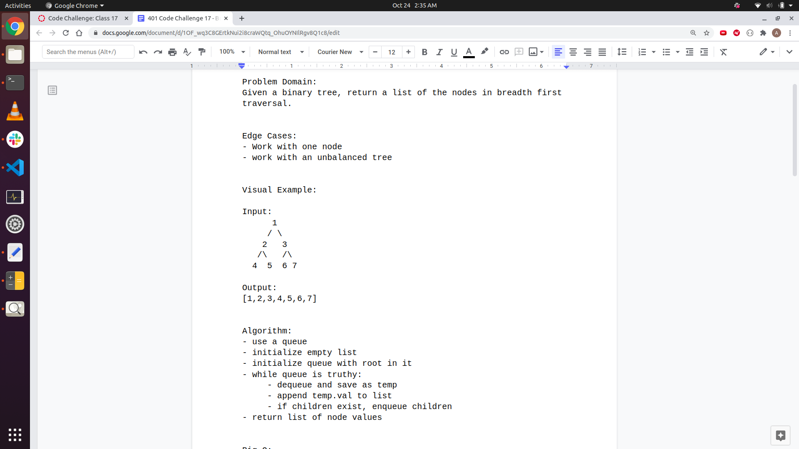
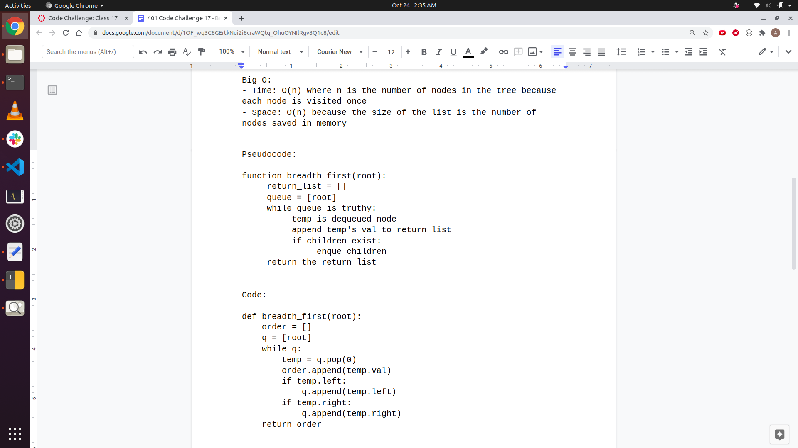
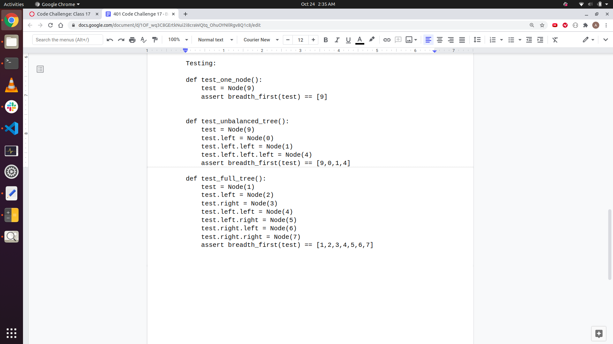


# Code Challenge 18
### Fizzbuzz Tree
Write a function called FizzBuzzTree which takes a k-ary tree as an argument.
Without utilizing any of the built-in methods available to your language, determine whether or not the value of each node is divisible by 3, 5 or both. Create a new tree with the same structure as the original, but the values modified as follows:
If the value is divisible by 3, replace the value with “Fizz”
If the value is divisible by 5, replace the value with “Buzz”
If the value is divisible by 3 and 5, replace the value with “FizzBuzz”
If the value is not divisible by 3 or 5, simply turn the number into a String.
Return a new tree.

### Challenge
```
Input:
        9
      / | \
     1  2  3
   /|\  |  |
 15 3 5 9  4

Output:
['fizz', '1', 'fizzbuzz', 'fizz', 'buzz', '2', 'fizz', 'fizz', '4']
```

### Approach and Efficiency
I used a pre-order, DFS, recursive algorithm with a helper function to travers the k-ary tree and return a new tree, as represented by a list, with fizzbuzz values inside of it. 

### Solution
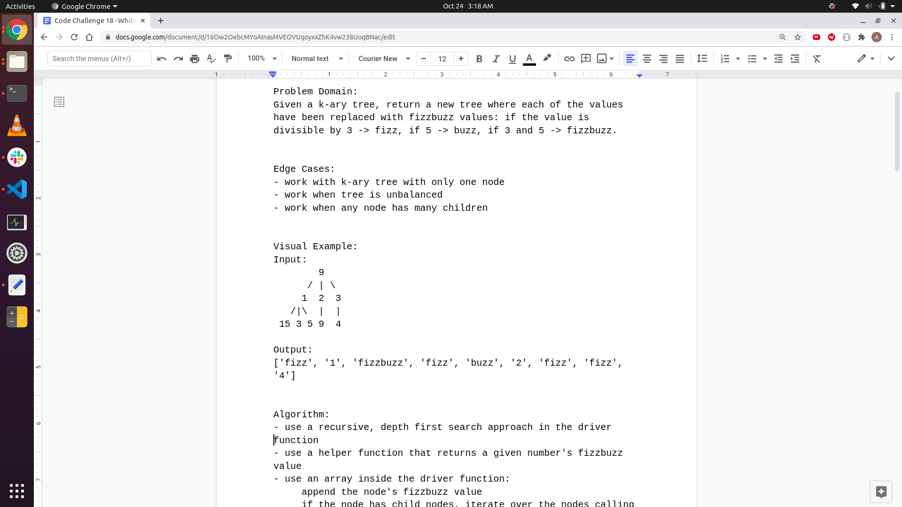
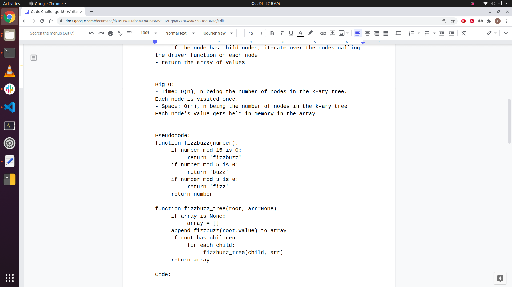
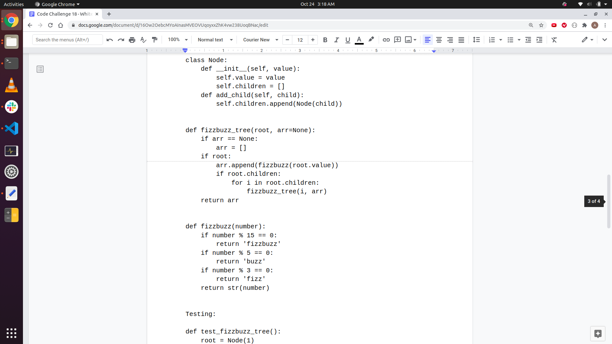
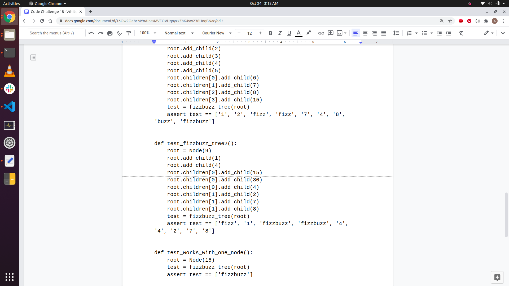


# Code Challenge 26
### Demonstration of Insertion Sort
Insertion sort is a simple sorting method wherein the algorithm first compares the 2nd element in an array to the first, and if it's smaller than the first it moves the second element to the left of the first. If the 2nd element is larger it stays put. 

Then the algorithm moves to the third element. If the 3rd is larger than the second, it stays put. Else if it is smaller than the 2nd, it moves to the left of the 2nd. Then it repeats the process comparing the element to the first element, moving to the left of the first if it is smaller.

In this way, the algorithm moves from the second element through the last element, moving each element to the left if it is smaller, and staying put if it is bigger.

If the element being sorted is the same size as any element being compared, the element being sorted does not move.

### Visual Example of Insertion Sort

Input:
[4, 3, 2, 10, 12]

Starts sorting 3:
[4, (3), 2, 10, 12]
  <--

[(3), 4, 2, 10, 12]

Sort 2:
[3, 4, (2), 10, 12]
     <--
  <--
[(2), 3, 4, 10, 12]

Sort 10:
[2, 3, 4, (10), 12]
           ^
           stays put
[2, 3, 4, (10), 12]

Sort 12:
[2, 3, 4, 10, (12)]
               ^
               stays put
[2, 3, 4, 10, (12)]


Output:
[2, 3, 4, 10, 12]


# Code Challenge 36
### Breadth-First Traversal of Graph
Extend your graph object with a breadth-first traversal method that accepts a starting node. Without utilizing any of the built-in methods available to your language, return a collection of nodes in the order they were visited. Display the collection.

### Challenge
```
Input:

0 2 3
|\|/
| 1-4
|/
5

breadth_first(3)

Output:
3, 1, 0, 2, 4, 5
```

### Approach and Efficiency
The graph is an undirected graph whose edges are represented by an adjacency list using a dictionary. I use a queue to traverse the graph starting at the source node, and a travelled list to keep track of traversed nodes. While the queue is truthy, dequeue, iterate over its list of edges, enqueueing if a given node has not been travelled to yet. I use a string to represent the traversal.

### Solution

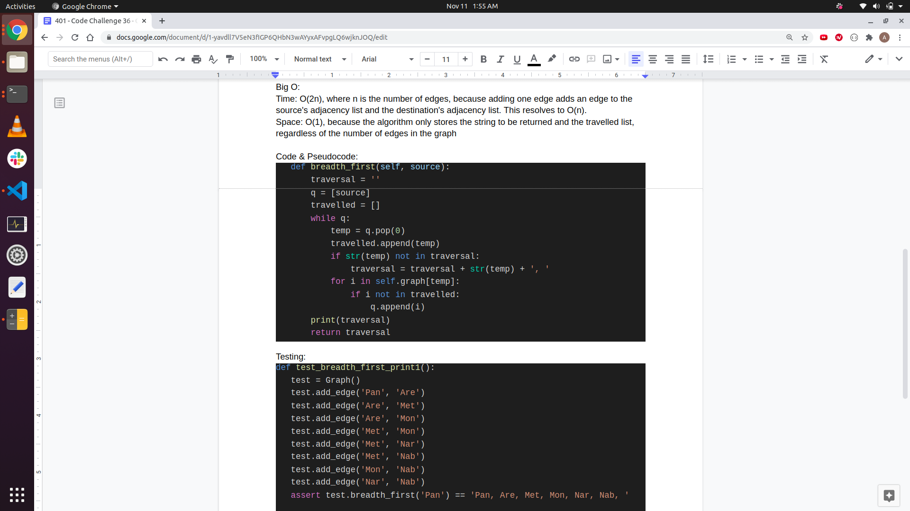
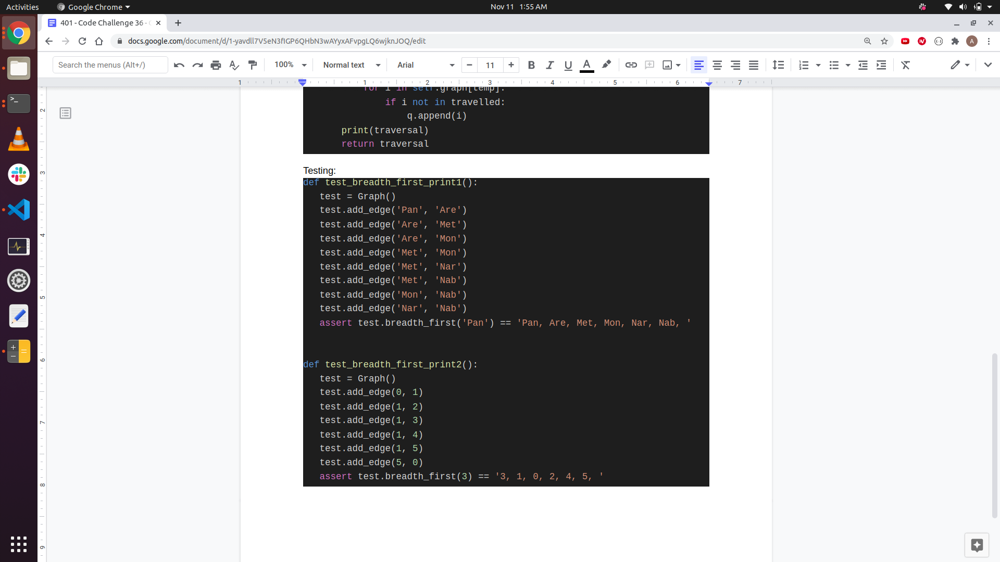


# Code Challenge 8
### Zip two linked lists
Write a function called zipLists which takes two linked lists as arguments. Zip the two linked lists together into one so that the nodes alternate between the two lists and return a reference to the head of the zipped list. Try and keep additional space down to O(1). You have access to the Node class and all the properties on the Linked List class as well as the methods created in previous challenges.

### Challenge
```
zipLists(list1, list2)
Arg list1 Arg list2	Output
head -> [1] -> [3] -> [2] -> X	head -> [5] -> [9] -> [4] -> X	head -> [1] -> [5] -> [3] -> [9] -> [2] -> [4] -> X
head -> [1] -> [3] -> X	head -> [5] -> [9] -> [4] -> X	head -> [1] -> [5] -> [3] -> [9] -> [4] -> X
head -> [1] -> [3] -> [2] -> X	head -> [5] -> [9] -> X	head -> [1] -> [5] -> [3] -> [9] -> [2] -> X
```

### Approach and Efficiency
I used an iterative approach with a while loop, with 2 pointers keeping tracking of the current position outside the while loop and two pointers inside the while loop (temp) keeping track the nexts. Then, I move the current nodes nexts to zip them together.

### Solution
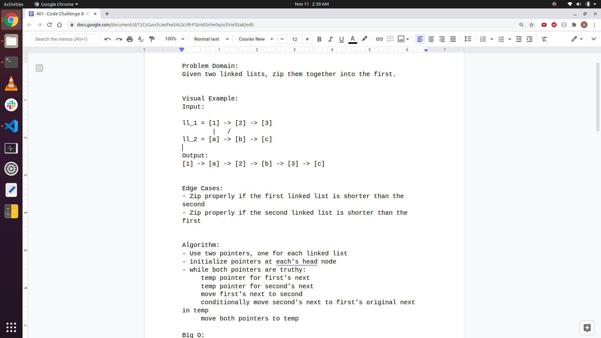
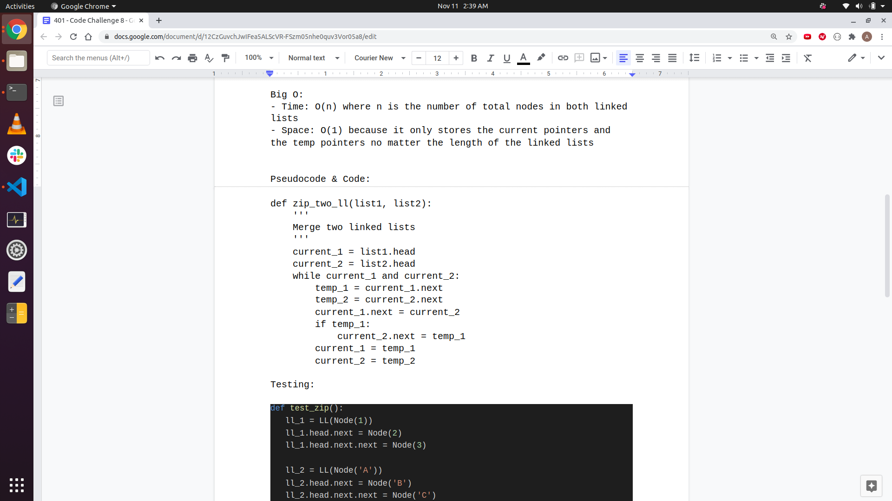
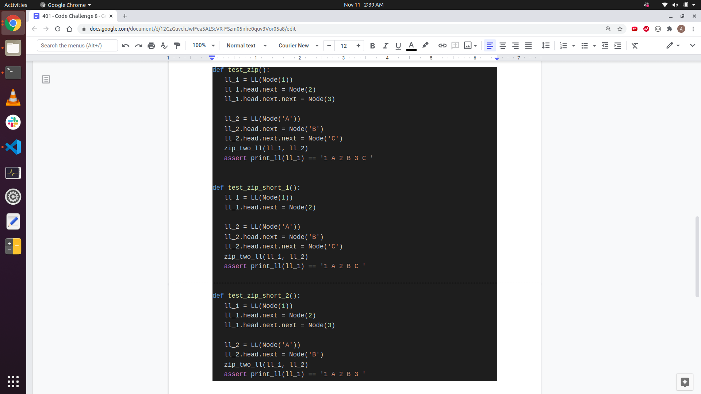
